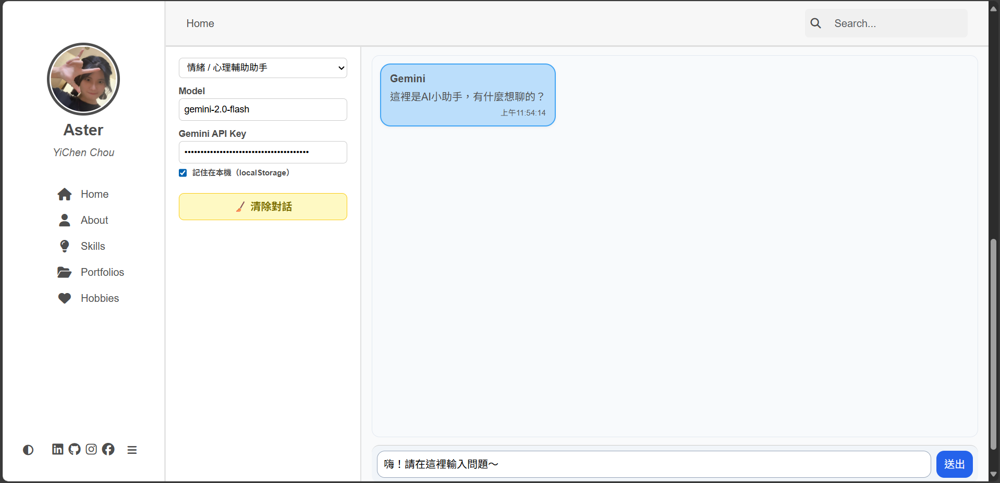

## 📝 專案簡介與功能說明
這是一個使用 **React** 開發的個人網站整合專案，結合 **AI 聊天功能**，能與使用者互動、回答問題或提供建議。  
主要功能包括：

- **個人資訊與作品展示**（整合原本的靜態網站 HTML/CSS/JS）  
- **AI 聊天助手**，可選擇不同情境：
  - 🧠 **情緒 / 心理輔助助手**：傾聽、鼓勵、提供建議  
  - 🎵 **興趣 / 專屬話題助手**：音樂、KPOP、鉤織相關  
  - 💻 **程式開發助理**：程式撰寫、除錯、邏輯解釋  
- 即時互動，顯示使用者訊息與 AI 回覆  
- 清除對話、快速範例問題按鈕  

---

## 🌐 使用的 API
- **[Google Gemini API](https://developers.generativeai.google/)**：提供 AI 文字生成功能  
- 可擴充其他公開 API，例如 OpenWeather、GitHub API、PokéAPI 等  

---

## ⚙️ 安裝與執行方式

1. **安裝相依套件**

```bash
npm install
```

2. **啟動專案**

```bash
npm start
```

---

## 🏃 使用方式

1. 開啟網站首頁，瀏覽個人資訊與作品展示

2. 選擇左側「情境助手」：

   - 🧠 情緒 / 心理輔助助手

   - 🎵 興趣 / 專屬話題助手

   - 💻 程式開發助理

3. 在聊天區輸入問題或訊息，按 Enter 或點擊 送出

4. 等待 AI 回覆訊息（可即時看到文字出現）

可以使用「快速範例問題」按鈕，快速測試 AI 功能

如需清除對話，可點擊左側 清除對話 按鈕

---

## 📸 畫面截圖

【首頁介面】


【AI 聊天區】


---

## 📝 注意事項

請確保已正確設定 Gemini API 金鑰，否則無法正常使用 AI 生成服務。
